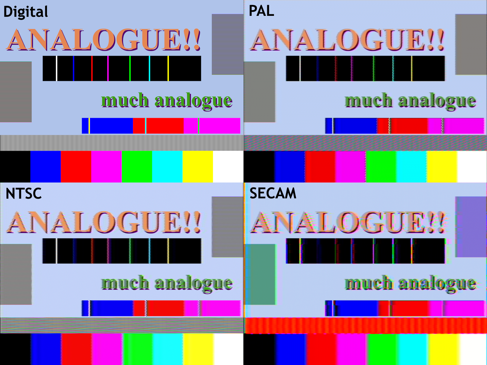

# AnalogueConvertEffect
**Physically realistic still-image analogue filter for Paint.NET**

# About
**AnalogueConvertEffect** is an image effect for Paint.NET. It makes images look like they are being displayed through analogue TV. To this end, the filtering is done in a standards-compliant and physically realistic way, by converting the image to an analogue signal, transforming the signal, and interpreting the final signal. Many qualities of real analogue video can be reproduced. All 3 major formats (NTSC, PAL and SECAM) are supported. You can toggle interlacing, add noise, add scanline jitter, change filter resonance, crosstalk and bandwidth, add distortion and also look at all valid combinations of the 3 colour channels. Experience the nostalgia! (CRT filter not included)

# But I don't use Paint.NET!
Don't worry! The decode/encode code is environment-agnostic, so it can easily be embedded in a filter for another program. There is only a small wrapper over this code just so that Paint.NET can use the decoder/encoder for the effect.